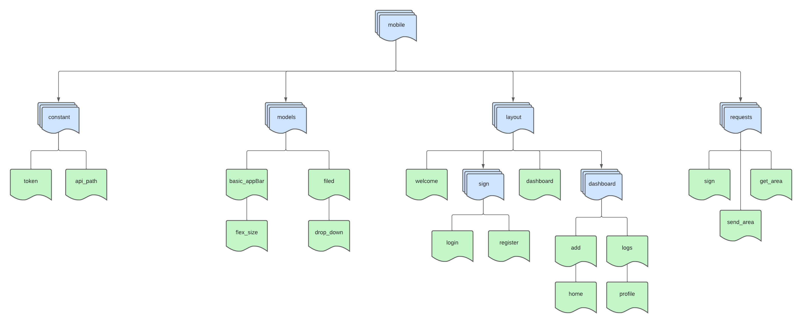
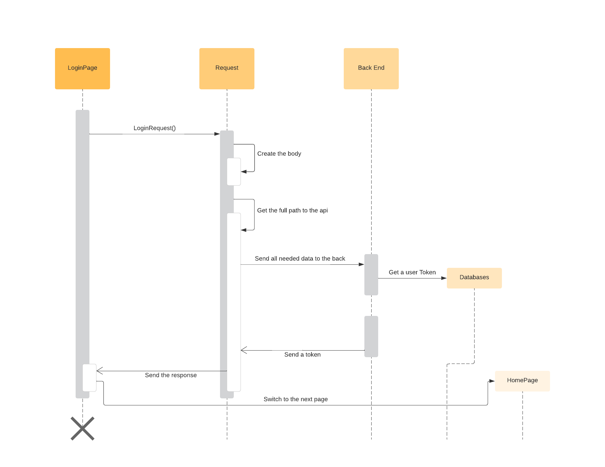

# AREA Android App

This readme explain how to get the apk by using flutter and how to run it on a android SDK

If you just want to get the apk you can go on http://localhost:8081/client.apk

# Prerequisites

Before building an APK with Flutter, you will need to:

- Install the Flutter SDK on your machine
- Install the Android SDK and tools on your machine
- Set up an emulator or connect a physical Android device to your machine

## Installing the Flutter SDK

To install the Flutter SDK, follow these steps:

- Download the Flutter SDK from the official website: https://flutter.dev/docs/get-started/install

- Extract the downloaded file to a directory of your choice.

- Add the Flutter SDK's bin directory to your PATH environment variable. You can do this by adding the following line to your .bashrc or .zshrc file:


```bash 
$ export PATH="$PATH:/path/to/flutter/bin"
```
- Run flutter doctor in your terminal to verify that Flutter is correctly installed and set up on your machine.

## Installing the Android SDK

To install the Android SDK and tools, follow these steps:

- Download and install Android Studio from the official website: https://developer.android.com/studio

- Launch Android Studio and open the SDK Manager by clicking on the SDK Manager icon in the toolbar.

- In the SDK Manager, select the "SDK Platforms" tab and check the box next to the version of Android you wish to target.

- In the SDK Manager, select the "SDK Tools" tab and check the box next to "Android SDK Build-Tools" and "Android Emulator".

- Click "Apply" to install the selected packages.

# Building the APK

To build the APK, follow these steps:

- Open a terminal window and navigate to the root directory of the project

- Run flutter build apk to build the APK
``` bash
$ flutter build apk --released
```

- Once the build process is complete, the APK will be located in the build/app/outputs/apk directory of the project.

# Architecture



This is the architecture of the mobile part.
There is 4 imports parts :

- constant (for example the api path)
- models (with custom reusable Widget)
- layout (with all pages, login, home, etc)
- requests (function that send request to the back end or to OAuth)


# Sequence Diagram



In this Diagram we can see an example of how a page with request.
Here it's an example for the login page, how the request are make